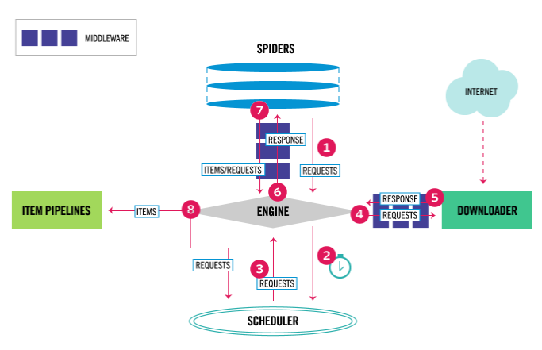

通过scrapy来抓取，能够更方便的下载图片和存储信息。



itempipline用来处理html数据，去重，存储数据，下载。框架有实现好的`FilesPipeline`，`ImagesPipeline`，`MediaPipeline`，用来下载文件，图片等。

itempipline可以处理item或者dict。


## how to use

1. 在spiders目录下，新建一个文件，作为spider，请求分析页面。定义自定义类继承自spider类。Spider must return Request, BaseItem, dict or None。

```python
import scrapy
class MySpider(scrapy.Spider):
    name = 'example.com'
    allowed_domains = ['example.com']
    start_urls = [
        'http://www.example.com/1.html',        
        'http://www.example.com/3.html',
    ]

    def parse(self, response):
        for h3 in response.xpath('//h3').getall():
            yield {"title": h3}

        for href in response.xpath('//a/@href').getall():
            yield scrapy.Request(response.urljoin(href), self.parse)
```

开启请求的链接，可以在`start_urls`中定义，也可以通过`start_quests`返回。`start_quests`需要返回一个可迭代的结果。`start_quests`只会被调用一次,所以`start_quests`可以是生成器。

当request不指定callback的时候，默认调用parse作为callback。这个方法需要返回可迭代的Request、dicts、item。

spider的介绍：https://docs.scrapy.org/en/latest/topics/spiders.html

2. 如果启用pipeline。在pipelines中新建pipeline的class。在setting.py中的`ITEM_PIPELINES`定义当前使用的itempipeline，并制定优先级。
    ```python
    {
        'myproject.pipelines.PricePipeline': 300,
        'myproject.pipelines.JsonWriterPipeline': 800,
    }
    ```


3.`start.py` 以脚本的方式运行scrapy。在脚本中指定需要用的spider。